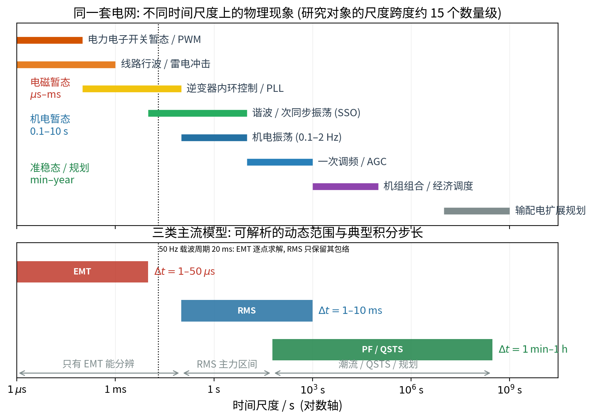

# 电磁暂态与数值积分：从元件方程到 EMTP

> **这篇文档要解决的问题**：EMT 程序每步到底在解什么方程？为什么它不能像潮流那样“代一下”就完事？
> 本文从最基本的元件方程出发，完整推导梯形法、伴随电路与节点方程，并说明步长、开关和数值振荡的来源。
> 目标是让人**不看代码也能自己写出一个最小的 EMT 求解器**。
>
> **前置知识**：KVL/KCL、一阶常微分方程、基本数值积分概念。
> **本文用法**：先读 §0–§4 建立“每步在解什么”的直觉，再读 §5–§7 的工程细节；文末有自测题。
> 本文独立自足，不依赖其他文档。

---

## 0. 为什么要瞬时域模型（动机）

一个交流系统在 50 Hz 下本来是“慢”的：一个周期 20 ms。只要关心的现象比 20 ms 慢得多
（负荷变化、机组出力、调度），就可以把电压电流的平均幅值与相位打包成**相量**，
把网络写成代数方程——这是潮流与 RMS 的出发点。

但变流器把“快”带了进来：

- IGBT/SiC 的开关频率 2–20 kHz（周期 50–500 μs）；
- 内环电流控制带宽 0.5–2 kHz；
- 电缆与滤波器的 LC 谐振可达数百 Hz–数十 kHz；
- 雷电冲击与行波的时间尺度是 μs 级。

这些现象的时间尺度与工频周期同量级甚至更快，相量假设（“信号在载波周期内近似不变”）
不再成立。要研究它们，只能直接求解瞬时量。

**关键区分**：EMT 与 RMS/潮流描述的是同一个物理系统，差别只在于**保留哪些时间导数**。
把这句话记住，后面所有推导都围绕它。

---

## 1. 集中参数元件的瞬时域方程

元件方程不是凭空来的。对集中参数元件，从电磁场方程做准静态近似即可得到：

| 元件 | 时域关系 | 说明 |
|---|---|---|
| 电阻 | $v_R(t)=R\,i_R(t)$ | 代数，无状态 |
| 电感 | $v_L(t)=L\dfrac{\mathrm{d}i_L}{\mathrm{d}t}$ | 状态为 $i_L$ |
| 电容 | $i_C(t)=C\dfrac{\mathrm{d}v_C}{\mathrm{d}t}$ | 状态为 $v_C$ |
| 耦合电感 | $\bm v=L\dfrac{\mathrm{d}\bm i}{\mathrm{d}t}+R\bm i$ | $L$ 为电感矩阵，含互漏抗 |
| 理想变压器 | 匝比约束 | 代数；工程上常加漏抗/励磁支路 |

**为什么要区分“代数”和“微分”**：微分元件需要初值且引入时间步进；代数元件不需要。
这直接决定了后面“每步要解多少个方程”。

---

## 2. 分布参数线路：从电报方程到 Bergeron 模型

长线和电缆不能用一个电感表示，因为波沿线路传播需要时间。设单位长度电感 $L'$、
电容 $C'$、电阻 $R'$，则**电报方程**为

$$
\frac{\partial v}{\partial x}=-R'i-L'\frac{\partial i}{\partial t},\qquad
\frac{\partial i}{\partial x}=-C'\frac{\partial v}{\partial t}.
\tag{2.1}
$$

对无损线（$R'=0$），令 $Z_c=\sqrt{L'/C'}$、$v_p=1/\sqrt{L'C'}$，方程化为两个行波方程：

$$
\left(\frac{\partial}{\partial x}+\frac{1}{v_p}\frac{\partial}{\partial t}\right)(v-Z_ci)=0,\qquad
\left(\frac{\partial}{\partial x}-\frac{1}{v_p}\frac{\partial}{\partial t}\right)(v+Z_ci)=0 .
\tag{2.2}
$$

式 (2.2) 的含义是：$v-Z_ci$ 沿线以 $+v_p$ 传播，$v+Z_ci$ 以 $-v_p$ 传播。
把式 (2.2) 沿特征线积分，得到**Bergeron 模型**：

$$
i_k(t)=\frac{v_k(t)}{Z_c}-\frac{v_m(t-\tau)}{Z_c}-\frac{v_k(t-\tau)}{Z_c}+\frac{v_m(t)}{Z_c}\cdot 0
+\underbrace{\text{损耗修正}}_{\text{可选}},
\qquad \tau=\frac{\ell}{v_p}=\ell\sqrt{L'C'}.
\tag{2.3}
$$

更常见的写法是把“只含历史量”的部分合成一个历史电流源：

$$
\boxed{\;i_k(t)=\frac{1}{Z_c}v_k(t)+I_k^{\text{hist}},\qquad
I_k^{\text{hist}}=-\frac{1}{Z_c}\bigl[v_m(t-\tau)+v_k(t-\tau)\bigr]-i_m(t-\tau)\;}
\tag{2.4}
$$

**这一步的意义**：式 (2.4) 的形式与集中电感的诺顿等值（第 4 节）完全相同——
都是“导纳 $+$ 历史电流源”。因此程序里分布参数线路和集中电感可以用同一套节点方程处理，
这是 EMTP 能统一处理各种元件的原因。

多相线路通过**模量变换**（Clarke、Karenbauer、Wedepohl）解耦为多个单模线路再逐模套用式 (2.4)。

**物理结论**：相量模型假设 $\tau\to0$（网络“瞬时建立”），
而行波模型保留 $\tau$；这解释了为什么只有 EMT 能算行波与雷电冲击。

---

## 3. 网络方程：节点分析法

把每个元件替换为“导纳 $+$ 电流源”或“电压源 $+$ 阻抗”后，对每个节点列 KCL：

$$
\sum_{\text{连接于}k} i_{kj}(t) = i_k^{\text{inj}}(t).
\tag{3.1}
$$

用节点电压 $\bm v(t)$ 表示后得到

$$
\boxed{\;\bm Y_n\,\bm v(t)=\bm i^{\text{inj}}(t)-\bm i^{\text{hist}}(t-\Delta t)\;}
\tag{3.2}
$$

- $\bm Y_n$：由所有元件电导组成的节点导纳矩阵（稀疏、对称、常实数，因为用梯形法后系数是实数）；
- $\bm i^{\text{hist}}$：所有贮能元件历史项之和；
- 非线性元件（避雷器、饱和变压器）用补偿法或牛顿法在内层迭代。

**式 (3.2) 与潮流方程的根本差别**：
式 (3.2) 是**线性的**（每步一次 LU 分解），潮流方程是**非线性的**（每步牛顿迭代）。
这解释了为什么 EMT 步数多但每步便宜，RMS/潮流步数少但每步贵。

---

## 4. 梯形积分与伴随电路（完整推导）

### 4.1 电感

对 $L\dfrac{\mathrm{d}i}{\mathrm{d}t}=v_L$ 在 $[t-\Delta t,t]$ 上积分：

$$
i_L(t)-i_L(t-\Delta t)=\frac{1}{L}\int_{t-\Delta t}^{t}v_L(\xi)\,\mathrm{d}\xi .
\tag{4.1}
$$

**梯形近似**：用两端点的均值近似积分

$$
\int_{t-\Delta t}^{t}v_L\,\mathrm{d}\xi
\approx\frac{\Delta t}{2}\bigl[v_L(t)+v_L(t-\Delta t)\bigr].
\tag{4.2}
$$

代入式 (4.1)：

$$
i_L(t)=i_L(t-\Delta t)+\frac{\Delta t}{2L}\bigl[v_L(t)+v_L(t-\Delta t)\bigr].
\tag{4.3}
$$

整理成“导纳 $\times$ 电压 $+$ 历史源”：

$$
\boxed{\;i_L(t)=\underbrace{\frac{\Delta t}{2L}}_{G_{eq}}v_L(t)
+\underbrace{i_L(t-\Delta t)+G_{eq}v_L(t-\Delta t)}_{I^{\text{hist}}(t-\Delta t)}\;}
\tag{4.4}
$$

### 4.2 电容

对偶地，$i_C=C\dfrac{\mathrm{d}v_C}{\mathrm{d}t}$ 用梯形法：

$$
v_C(t)=v_C(t-\Delta t)+\frac{\Delta t}{2C}\bigl[i_C(t)+i_C(t-\Delta t)\bigr],
\tag{4.5}
$$

解出 $i_C(t)$：

$$
\boxed{\;i_C(t)=\underbrace{\frac{2C}{\Delta t}}_{G_{eq}}v_C(t)
+\underbrace{\Bigl[-i_C(t-\Delta t)-G_{eq}v_C(t-\Delta t)\Bigr]}_{I^{\text{hist}}}\;}
\tag{4.6}
$$

### 4.3 误差与稳定性

把式 (4.2) 与精确积分比较可得局部截断误差

$$
\int_{t-\Delta t}^{t}v\,\mathrm{d}\xi-\frac{\Delta t}{2}\bigl[v(t)+v(t-\Delta t)\bigr]
=-\frac{\Delta t^3}{12}\ddot v(\xi)+O(\Delta t^5).
\tag{4.7}
$$

因此梯形法是**二阶精度**。对线性试验方程 $\dot x=\lambda x$，其放大因子为

$$
R(z)=\frac{1+z/2}{1-z/2},\qquad z=\lambda\Delta t,
\tag{4.8}
$$

且 $|R(z)|\le1$ 对任意 $\mathrm{Re}(z)\le0$ 成立（**A-稳定**）。
A-稳定性保证了纯数值原因不会发散，但**不保证没有数值振荡**：
当 $\lambda\Delta t$ 是绝对值很大的负实数时，$R(z)\to-1$，
数值解会以 $(-1)^n$ 的形式振荡而衰减很慢——这就是刚性切换后“假振荡”的来源。

### 4.4 临界阻尼调整（CDA）

工程上在突变（开关动作、故障）后若干步把历史项替换为

$$
I^{\text{hist}}(t-\Delta t)\leftarrow
\frac{1}{2}\Bigl[I^{\text{hist}}(t-\Delta t)+I^{\text{hist}}(t-2\Delta t)\Bigr],
\tag{4.9}
$$

等价于把该步的积分格式局部退化为**后向欧拉**（一阶、L-稳定、强阻尼），
用一个时步的二阶精度换取无振荡。稳定判据与实现细节见 Dommel 1969。

---

## 5. 步长、误差与“刚性”

由式 (4.2) 的二阶精度与经验采样要求，步长下界由**最高关心频率** $f_{\max}$ 决定：

$$
\Delta t\lesssim\frac{1}{10\sim20\,f_{\max}},
\qquad f_{\max}=\max\{f_{sw},\ f_{\text{resonance}},\ 1/(2\pi\sqrt{LC})\}.
\tag{5.1}
$$

- 若 $f_{sw}=10$ kHz：$\Delta t\lesssim5\ \mu$s；
- 若研究雷电冲击（$f_{\max}\sim$ MHz）：$\Delta t\lesssim0.05\ \mu$s。

仿真的总时长由**最慢**关注现象决定（例如机电振荡 10 s）。于是所需步数

$$
N_{\text{step}}=\frac{T_{\text{slow}}}{\Delta t_{\text{fast}}}
\sim\frac{10\ \text{s}}{10^{-6}\ \text{s}}=10^{7},
\tag{5.2}
$$

**这就是“刚度比”的工程含义**：慢窗口与快步长的矛盾，
也是为什么全 EMT 不能作为大系统的常规分析工具（本项目图 7 给出数值化的刚度比）。

---

## 6. 开关处理

理想开关使系统在拓扑间跳变，处理方式有三类：

1. **插值法**：检测开关动作时刻 $t_s\in(t-\Delta t,t)$，插值重解到 $t_s$，再继续。
   精度高，但要重算一步。
2. **双步长/半步法**：动作附近用半步。
3. **补偿法 vs 拓扑法**：
   - 拓扑法：改变 $\bm Y_n$，需要重新三角分解（昂贵但精确）；
   - 补偿法：用一个附加支路表示开关，$\bm Y_n$ 不变，用 Sherman–Morrison 修正求解（快，有一定误差）。

变流器的 PWM 是高频开关事件，若每个开关都插值，代价很高；
工程上常用**固定小步长 + 开关时刻取最近网格**，并靠小步长控制误差。

---

## 7. 变流器模型的三档精度

| 模型 | 保留的物理 | 需要的步长 | 典型用途 |
|---|---|---|---|
| 开关级详细模型 | 每个阀、PWM、死区、缓冲电路 | 1–10 μs | 换流器损耗、谐波、故障穿越、阀应力 |
| 平均值模型 | 基波与低次谐波、内外环控制、PLL | 10–50 μs | 系统级 EMT、稳定性 |
| 受控源/相量接口模型 | 仅基频 | 与 RMS 同 | 混合仿真接口 |

选择依据不是“越详细越好”，而是“关心的频率是否被保留”。

---

## 8. 常见误解

1. **“梯形法 A-稳定，所以步长可以随便取”**——错。A-稳定只保证不发散，
   精度与数值振荡仍要求 $\Delta t$ 小于最快动态的时间常数；CDA 是补丁不是万能。
2. **“EMT 比 RMS 更精确，所以应该优先用 EMT”**——错。模型精度取决于假设与目标是否匹配；
   用 EMT 算 10 分钟级规划问题既慢又无必要（本项目图 1 的时间尺度谱）。
3. **“相量模型是 EMT 的近似，所以 EMT 一定更准”**——需分清“哪一部分更准”：
   EMT 在快动态上更准，但若模型中开关/控制参数不准，误差同样大。
4. **“分布参数线路就是多个 π 型串联”**——在关注频率较低时可近似，
   但行波到达时刻与波阻抗特性会失真；行波问题必须用 Bergeron/频率相关模型。

---

## 9. 软件与 benchmark

**EMT 软件**：PSCAD/EMTDC、EMTP-RV、ATP-EMTP、DIgSILENT PowerFactory（EMT）、
MATLAB/Simulink Simscape Electrical、OpenModelica；研究型：MATEMTP、Dynaωo 的 EMT 扩展。

**benchmark**：
- 输电网 IEEE 9/14/39/118；WSCC 3 机 9 节点（EMT/RMS 对照经典算例）；
- 配电网 IEEE 13/34/123 节点测试馈线、CIGRE MV/LV；
- 变流器 CIGRE B4 直流基准、WECC 第二基准（含 IBR）。

---

## 10. 与项目的联系

- 项目对 EMT 的定位（不作主线）在本文件中得到工程解释：式 (5.2) 的 $10^7$ 步数；
- 准稳态判据（包络带宽 $\ll$ 载波频率）正是“能否把式 (4.4) 退化为代数关系”的条件；
- 对本项目：EMT 用于局部校验与判据提供，而非全网主算。

**延伸阅读**：H. W. Dommel, *Digital computer solution of electromagnetic transients
in single- and multiphase networks*, IEEE Trans. PAS, 1969；
N. Watson, J. Arrillaga, *Power Systems Electromagnetic Transients Simulation*, IET, 2007。

---

## 自测题

1. 为什么电感在梯形法下可以写成“一个电导 $+$ 一个电流源”？历史项依赖哪些量？
2. 梯形法是 A-稳定的，为什么仍会出现数值振荡？CDA 做了什么、代价是什么？
3. 为什么分布参数线路（Bergeron）和集中电感可以用同一套节点方程求解？

参考答案要点

1. 用两端点均值近似积分得到式 (4.3)，整理后 $i_L=G_{eq}v_L+I^{hist}$，
   其中 $G_{eq}=\Delta t/(2L)$；历史项依赖 $i_L(t-\Delta t)$ 与 $v_L(t-\Delta t)$，即上一步的电流与电压。
2. A-稳定只保证不发散；当 $\lambda\Delta t$ 为大负实数时放大因子 $R(z)\to-1$，
   解以 $(-1)^n$ 形式振荡。CDA 把历史项做半步平均，等价于局部退化为 L-稳定的后向欧拉，
   代价是那一小段时间只有一阶精度。
3. 两者化简后都是“诺顿等值（导纳 $+$ 历史电流源）”，因此节点方程形式一致；
   差别只在于波阻抗 $Z_c$ 与行波时间 $\tau$ 取代了 $G_{eq}$ 与一步历史。

