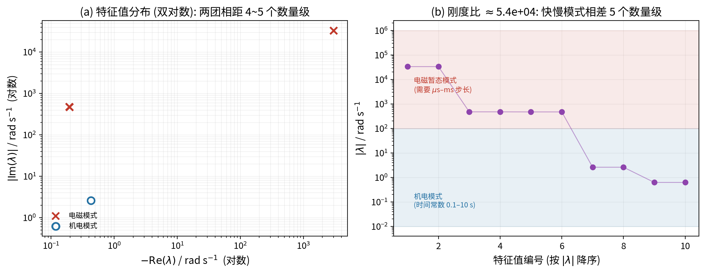
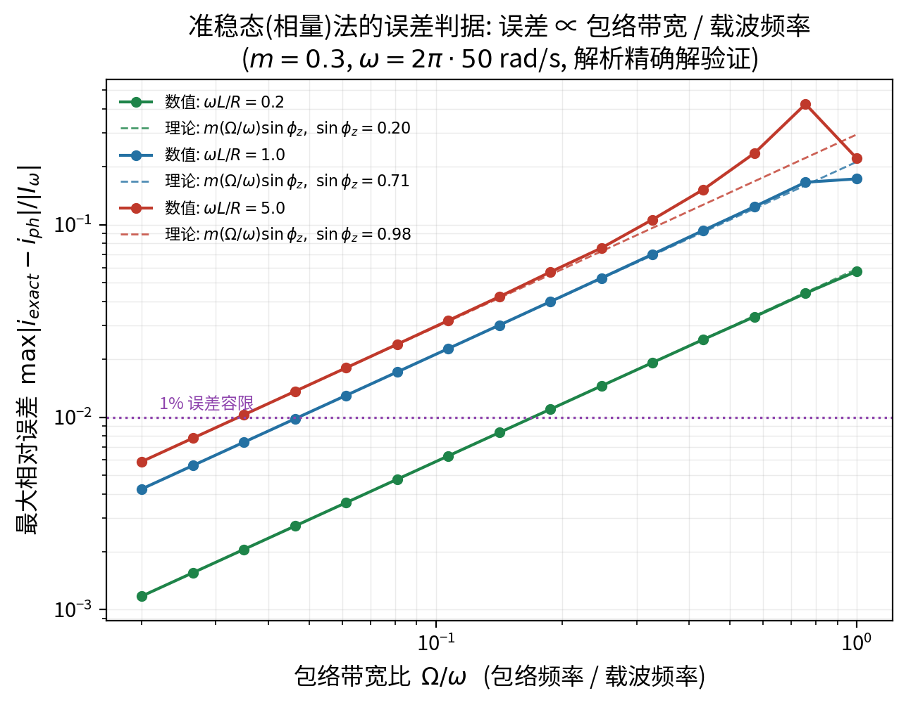

# 多尺度与奇异摄动：为什么可以“忽略快动态”

> **这篇文档要解决的问题**：潮流/RMS 凭什么把某些动态直接删掉？删掉的误差有多大？
> “降阶”在数学上到底是什么操作？本文给出奇异摄动的完整推导（外解、内解、匹配）、
> Park 变换与复包络的完整推导，并说明电网里的 $\varepsilon$ 是多少。
> 目标是**能把“忽略快动态”写成一个可证明误差界的操作**，而不是经验说法。
>
> **前置知识**：常微分方程、线性系统特征值、渐近展开的基本思想。
> **本文用法**：§2–§4 给出奇异摄动的完整推导，§6–§7 给出 Park 变换与准稳态误差；
> 两者共同回答“为什么能忽略快动态、误差多大”；文末有自测题。本文独立自足。

---

## 1. 问题的提出

在电网里我们同时面对两套时间尺度：

- 电磁：$L/R$、$\sqrt{LC}$，量级 $10^{-6}$–$10^{-3}$ s；
- 机电：惯量 $M/D$、振荡频率 $\sqrt{K/M}$，量级 $0.1$–$10$ s。

两者相差 $10^4$–$10^6$ 倍。若直接数值积分完整方程，步长被快尺度限制、
总时长被慢尺度要求，计算量爆炸（步数与刚度比同量级，本文 §5 给出电网的刚度比量级）。
“忽略快动态”因此是必须的，但必须回答两个问题：

1. **合法吗？**——什么条件下忽略是安全的？
2. **误差多大？**——忽略带来的定量偏差是多少？

奇异摄动理论正是回答这两个问题的语言。

---

## 2. 时间尺度分离的形式

把状态分成慢变量 $\bm x\in\mathbb R^p$ 与快变量 $\bm z\in\mathbb R^q$，写成

$$
\dot{\bm x}=\bm f(\bm x,\bm z),\qquad
\varepsilon\,\dot{\bm z}=\bm g(\bm x,\bm z),\qquad
0<\varepsilon\ll1 .
\tag{2.1}
$$

$\varepsilon$ 是**快慢时间常数之比**。在电网里：

$$
\varepsilon_{\text{grid}}\sim\frac{\tau_{\text{em}}}{\tau_{\text{mech}}}
=\frac{L/R}{M/D}\sim10^{-6}\text{–}10^{-4}.
\tag{2.2}
$$

**为什么必须有 $\varepsilon$ 乘在 $\dot{\bm z}$ 上**：
如果没有这个因子，快尺度（$\bm z$ 的时间常数 $\sim\varepsilon$）就不会显现；
乘上后，$\bm z$ 可以在 $O(\varepsilon)$ 时间内完成变化，而 $\bm x$ 几乎不动。
这就是“边界层”的来源。

---

## 3. 慢流形：令 $\varepsilon\to0$

令 $\varepsilon\to0$，式 (2.1) 的第二个方程退化为**代数约束**

$$
\bm g(\bm x,\bm z)=\bm 0 .
\tag{3.1}
$$

**关键假设（隐函数定理）**：若 $\dfrac{\partial\bm g}{\partial\bm z}$ 在关注区域可逆，
则式 (3.1) 局部唯一确定

$$
\bm z=\bm h(\bm x),
\tag{3.2}
$$

代回第一个方程得到**降阶慢系统**

$$
\boxed{\;\dot{\bm x}=\bm f\bigl(\bm x,\bm h(\bm x)\bigr)=:\bm f_r(\bm x)\;}
\tag{3.3}
$$

式 (3.2) 的曲面称为**慢流形**（slow manifold），式 (3.3) 是它在慢时间尺度上的运动。

**物理翻译**：$\partial\bm g/\partial\bm z$ 可逆 $=$ 快子系统在慢变量的“冻结”值下稳定。
对电网：网络电磁子系统是耗散的（电阻耗能），所以满足；这正是 RMS 可以代数化网络的数学条件。

---

## 4. 一点例子：把整套渐近展开做完

取最简单的标量系统（本项目图 6 用的就是它的推广）：

$$
\dot x=-x+z,\qquad \varepsilon\dot z=\tanh x-z .
\tag{4.1}
$$

### 4.1 外解（$\varepsilon\to0$ 的慢解）

令 $\varepsilon=0$：$z=\tanh x$，代入得

$$
\dot x_0=-x_0+\tanh x_0=:f_r(x_0).
\tag{4.2}
$$

以 $x_0(0)=2$ 为例，式 (4.2) 的数值解就是我们想要的“降阶解”。

### 4.2 内解（边界层，拉伸时间 $\tau=t/\varepsilon$）

在 $t\sim O(\varepsilon)$ 时，$x$ 几乎不变，令 $\tau=t/\varepsilon$：

$$
\frac{\mathrm d z}{\mathrm d\tau}=\tanh x-z,\qquad x\approx x(0)=2 .
\tag{4.3}
$$

解为

$$
z(\tau)=\tanh 2+\bigl[z(0)-\tanh 2\bigr]e^{-\tau}.
\tag{4.4}
$$

**这正是本项目图 6(b) 的“边界层”**：$z$ 以时间常数 $\varepsilon$ 从初值 $z(0)$ 收敛到 $\tanh 2$。
边界层厚度（时间）$\propto\varepsilon$，见图 6(c)（斜率 1 的直线）。

### 4.3 匹配与复合解

要求内解在 $\tau\to\infty$ 与外解在 $t\to0$ 一致：

$$
\lim_{\tau\to\infty}z_{\text{in}}=\tanh x(0)=z_{\text{out}}(0),
\tag{4.5}
$$

这就是**匹配条件**。复合一致解为

$$
z(t)\approx z_{\text{out}}(t)+\bigl[z(0)-\tanh x(0)\bigr]e^{-t/\varepsilon},
\tag{4.6}
$$

即在慢流形解上叠加一个按 $e^{-t/\varepsilon}$ 衰减的边界层修正。
式 (4.6) 就是“忽略快动态”的定量含义：**误差被边界层项控制，时间 $O(\varepsilon)$ 后忽略是安全的**。

### 4.4 Tikhonov 定理（误差界）

一般情形下有如下结论（Tikhonov / Vasil'eva）：

> 若 $\bm g=\bm 0$ 的根 $\bm z=\bm h(\bm x)$ 存在且在关注的 $\bm x$ 区域内，
> 快子系统 $\dfrac{\mathrm d\bm z}{\mathrm d\tau}=\bm g(\bm x,\bm z)$ 的平衡点 $\bm h(\bm x)$
> 一致渐近稳定，则对任意 $T>0$，当 $\varepsilon\to0$ 时
> $$
> \|\bm z(t)-\bm h(\bm x_r(t))\|\le C\varepsilon
> +C' e^{-t/\varepsilon},\qquad 0\le t\le T,
> \tag{4.7}
> $$
> 其中 $\bm x_r$ 是降阶系统 (3.3) 的解。

**读法**：误差 $=$ 边界层项（指数衰减）$+$ 稳态偏差 $O(\varepsilon)$。
两者都可估计，因此“忽略快动态”不是经验，而是有界的近似。

---

## 5. 电网里的 $\varepsilon$ 与刚度比

式 (2.2) 的 $\varepsilon$ 在真实系统里体现为**特征值谱的分离**。对线性化系统

$$
\dot{\bm x}=\bm A\bm x,\qquad \bm A\in\mathbb R^{n\times n},
\tag{5.1}
$$

特征值 $\lambda_i$ 分两团：

- 快团：$|\lambda|\sim R/L$、$1/\sqrt{LC}$、开关频率 → $10^3$–$10^6$ rad/s；
- 慢团：$|\lambda|\sim D/M$、$\sqrt{K/M}$ → $0.1$–$10$ rad/s。

**刚度比**（stiffness ratio）

$$
\kappa=\frac{\max_i|\lambda_i|}{\min_i|\lambda_i|}\sim10^4\text{–}10^6 .
\tag{5.2}
$$

显式积分的步长受 $\max|\lambda_i|$ 限制，总时长受 $\min|\lambda_i|$ 要求，因此

$$
N_{\text{step}}\sim\kappa\cdot\frac{T_{\text{slow}}}{T_{\text{fast,unit}}}
\sim\kappa\cdot O(1)\ \text{（量级上）}.
\tag{5.3}
$$

本项目图 7 用一个 10 阶 $dq$ 模型（无穷大母线 $+$ 两段 RL $+$ 电容 $+$ 一台同步机）
数值算得 $\kappa\approx5\times10^4$，脚本 `python/fig07_spectrum.py`。

---

## 6. Park 变换：把载波变成直流（完整推导）

### 6.1 变换矩阵

设同步旋转角 $\theta=\omega_s t+\theta_0$，定义

$$
\bm T(\theta)=\frac{2}{3}
\begin{pmatrix}
\cos\theta & \cos(\theta-\tfrac{2\pi}{3}) & \cos(\theta+\tfrac{2\pi}{3})\\
-\sin\theta & -\sin(\theta-\tfrac{2\pi}{3}) & -\sin(\theta+\tfrac{2\pi}{3})\\
\tfrac12 & \tfrac12 & \tfrac12
\end{pmatrix}.
\tag{6.1}
$$

系数 $2/3$ 使变换**幅值不变**（正序幅值在 $dq$ 中不变）。其逆为

$$
\bm T^{-1}(\theta)=
\begin{pmatrix}
\cos\theta & -\sin\theta & 1\\
\cos(\theta-\tfrac{2\pi}{3}) & -\sin(\theta-\tfrac{2\pi}{3}) & 1\\
\cos(\theta+\tfrac{2\pi}{3}) & -\sin(\theta+\tfrac{2\pi}{3}) & 1
\end{pmatrix}.
\tag{6.2}
$$

### 6.2 验证：对称正序 → 直流

取 $v_a=V\cos\omega_s t$，$v_b=V\cos(\omega_s t-\tfrac{2\pi}{3})$，
$v_c=V\cos(\omega_s t+\tfrac{2\pi}{3})$，$\theta=\omega_s t$。代入式 (6.1) 第一行：

$$
v_d=\frac{2}{3}V\Bigl[\cos^2\theta+\cos^2(\theta-\tfrac{2\pi}{3})+\cos^2(\theta+\tfrac{2\pi}{3})\Bigr]
=\frac{2}{3}V\cdot\frac{3}{2}=V,
\tag{6.3}
$$

这里用到恒等式 $\sum_{k=0}^{2}\cos^2(\theta-\tfrac{2k\pi}{3})=\dfrac32$。同理

$$
v_q=0,\qquad v_0=0 .
\tag{6.4}
$$

**这就是相量模型能“丢掉 50 Hz 载波”的数学原因**：在同步旋转坐标系里，
载波变成了常数，剩下的只有慢变包络。

### 6.3 时变幅值/相位 → 慢变量

若 $v_a=A(t)\cos(\omega_s t+\varphi(t))$，其中 $A,\varphi$ 慢变，则

$$
v_d\approx A(t)\cos\varphi(t),\qquad v_q\approx A(t)\sin\varphi(t),
\tag{6.5}
$$

即 $dq$ 分量就是**复包络的实部与虚部**。这把“瞬时波形”与“相量”联系了起来，
也是混合仿真接口（滑动 DFT 提取相量）的基础。

### 6.4 RL 支路的 $dq$ 方程与交叉耦合

由 $v_{abc}=Ri_{abc}+L\dot i_{abc}$，代入 $i_{abc}=\bm T^{-1}i_{dq0}$：

$$
v_{dq0}=Ri_{dq0}+L\bm T^{-1}\dot i_{dq0}+L\dot{\bm T}^{-1}i_{dq0}.
\tag{6.6}
$$

利用 $\dot{\bm T}^{-1}=\bm T^{-1}\dot\theta\bm S$，$\bm S=\begin{pmatrix}0&1\\-1&0\end{pmatrix}$，得

$$
\boxed{\;v_d=Ri_d+L\dot i_d-\omega_sLi_q,\qquad
v_q=Ri_q+L\dot i_q+\omega_sLi_d\;}
\tag{6.7}
$$

**注意**：$\omega_sLi_q$、$\omega_sLi_d$ 来自坐标旋转，**不是**电磁暂态；
$L\dot i_d,L\dot i_q$ 才是。RMS 保留前者、忽略后者；EMT 两者都保留。
这解释了本项目图 2 中“网络 $L,C$ 电磁暂态”一行在 RMS 是 $\times$、而“非额定频率偏离”是 $\approx$。

---

## 7. 复包络与准稳态误差（完整推导）

### 7.1 复包络方程

考虑单相 $RL$ 支路 $v=Ri+L\dot i$，设

$$
v(t)=\Real\{V(t)e^{\jmath\omega_st}\},\qquad
i(t)=\Real\{I(t)e^{\jmath\omega_st}\},
\tag{7.1}
$$

其中 $V,I$ 是复包络（相对载波 $e^{\jmath\omega_st}$ 慢变）。求导：

$$
\dot i=\Real\bigl\{(\dot I+\jmath\omega_sI)e^{\jmath\omega_st}\bigr\}.
\tag{7.2}
$$

代回并只保留基频分量（即忽略 $I$ 的二倍频分量），得**复包络方程**

$$
(R+\jmath\omega_sL)I(t)+L\dot I(t)=V(t).
\tag{7.3}
$$

### 7.2 零阶解与一阶修正

令 $Z(\jmath\omega_s)=R+\jmath\omega_sL$。

- 零阶（准稳态/相量）：

$$
I_0(t)=\frac{V(t)}{Z}.
\tag{7.4}
$$

- 一阶修正：把 $I=I_0+\delta I$ 代入式 (7.3)，并注意 $\dot I_0$ 已是小量：

$$
Z\,\delta I\approx-L\dot I_0\quad\Longrightarrow\quad
\delta I=-\frac{L}{Z}\,\dot I_0 .
\tag{7.5}
$$

### 7.3 误差公式

设包络含慢变调制 $V(t)=V_0(1+m\sin\Omega t)$，则

$$
|\dot I_0|_{\max}=\frac{m\Omega|V_0|}{|Z|}=m\Omega|I_0|,
\tag{7.6}
$$

于是相对误差

$$
\boxed{\;\varepsilon_{\text{qs}}=\frac{|\delta I|_{\max}}{|I_0|}
=m\,\frac{\Omega}{\omega_s}\,\frac{\omega_sL}{|Z|}
=m\,\frac{\Omega}{\omega_s}\,\sin\phi_z,\qquad
\phi_z=\arctan\frac{\omega_sL}{R} .\;}
\tag{7.7}
$$

### 7.4 判据与三个推论

式 (7.7) 说明：

1. **误差 $\propto$ 包络带宽 / 载波频率**。带宽越宽（DER 波动快）误差越大。
2. **系数 $\sin\phi_z\le1$**：感性主导（$\omega_sL\gg R$）时误差最大；
   阻性主导（$R\gg\omega_sL$）时误差趋于 0。
3. **实用准则**：要 $\varepsilon_{\text{qs}}<\eta$，需
   $\Omega/\omega_s<\eta/(m\sin\phi_z)$。$m\sim0.3$、$\sin\phi_z\sim1$、$\eta=1\%$ 时
   $\Omega/\omega_s<3\%$，即包络带宽要低于约 1.6 Hz。

本项目图 5 对线性系统的精确稳态解（含 $\omega_s\pm\Omega$ 边带）做了数值验证，
数值与式 (7.7) 的斜率一致。

### 7.5 与 EMT/RMS/PF 的对应

- **EMT**：保留式 (7.3) 的全部项；
- **RMS**：令 $\dot I=0$（准稳态），误差由式 (7.7) 给出；
- **PF**：进一步令 $\dot V=0$（包络不变），即静态相量。

三者是同一个方程在不同近似水平上的截断。

---

## 8. 常见误解

1. **“忽略快动态就是丢掉快变量”**——不是。是把它约束到慢流形上（式 3.2），
   它仍然存在，只是不再独立演化。
2. **“$\varepsilon$ 小就一定可以忽略”**——需要快子系统稳定（Tikhonov 条件）。
   若快子系统本身不稳定，代数约束不成立，降阶会给出错误结论。
3. **“准稳态误差只和频率有关”**——它还和 $m$（调制深度）与 $\sin\phi_z$（$R/X$ 比）有关（式 7.7）。
4. **“Park 变换可以任意忽略 $\dot I$”**——$dq$ 下的交叉耦合项 $\omega_sL$ 与
   $\dot I$ 项不是一回事（式 6.7），混淆二者是常见错误。

---

## 9. 与项目的联系

- 潮流与 RMS 的三层连接由本文串起：工作点（§3）、瞬时--相量（§6--7）、奇异摄动（§2--5）；
- 本项目的“刚度比 $10^4$–$10^6$”由式 (5.2) 与图 7 支撑；
- 本项目：式 (7.7) 是判断“能不能用 QSTS 替代动态仿真”的定量依据，
  可直接写进建模方案或专利的实施条件。

**延伸阅读**：A. N. Tikhonov 等，*Ordinary Differential Equations*；
H. K. Khalil, *Nonlinear Systems*（奇异摄动章节）；
P. Kundur, *Power System Stability and Control*, 1994（Park 变换与 $dq$ 模型）。

---

## 自测题

1. 慢流形存在的数学条件是什么？为什么它对电网通常成立？
2. $dq$ 方程中的 $\omega_sL$ 交叉项来自哪里？它与 $L\dot i$ 项的本质区别是什么？
3. 准稳态误差与哪三个量有关？为什么“阻性主导”的电网即使波动快也较准？

参考答案要点

1. 条件是 $\partial\bm g/\partial\bm z$ 可逆，即快子系统稳定；
   电网中网络电磁子系统有电阻耗散，因此通常满足。
2. 交叉项来自坐标旋转（$\dot{\bm T}^{-1}=\bm T^{-1}\dot\theta\bm S$），
   描述的是“同一个空间矢量在不同旋转坐标系下的表现”，不含储能动态；
   $L\dot i$ 才是电磁暂态（储能变化）。RMS 保留前者、忽略后者。
3. 与 $m$（调制深度）、$\Omega/\omega_s$（带宽比）、$\sin\phi_z$（$R/X$ 比）有关；
   阻性主导时 $\sin\phi_z\to0$，相量关系接近“瞬时比例”，故误差小。

