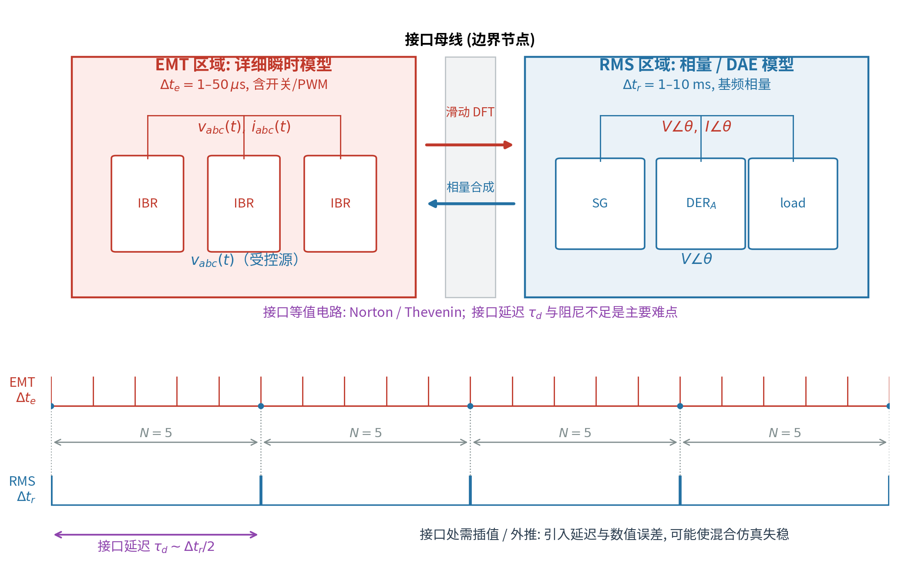
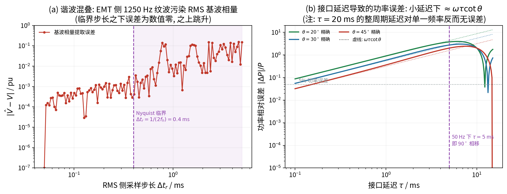

# 混合仿真接口：瞬时与相量之间传什么、代价是什么

> **这篇文档要解决的问题**：EMT 与 RMS 放在一起仿真时，接口到底交换什么变量？
> 滑动 DFT 怎么把瞬时波形变成相量？为什么接口会引入延迟，延迟又怎样变成误差与失稳？
> 本文给出接口变量映射、功率一致性、延迟误差与 Nyquist 约束的完整推导。
> 目标是**能设计并评估一个最小可用的混合仿真接口**。
>
> **前置知识**：相量与复数、采样定理、反馈系统相位裕度的基本概念。
> **本文用法**：§2 讲接口变量映射，§5–§7 讲延迟误差、混叠与稳定性；文末有自测题。
> 本文独立自足，不依赖其他文档。

---

## 1. 动机：为什么要“混合”

完整 EMT 建模整个城市电网的计算量由刚度比决定（计算量随刚度比线性增长），
在 $10^4$–$10^6$ 量级上不可行。但真正需要 EMT 的往往只是局部：

- 新能源场站/微电网内部的多变流器相互作用；
- 弱电网、低短路比区域；
- 高压直流馈入点、构网型变流器；
- 需要看行波或开关暂态的故障点。

其余大电网用 RMS/相量模型即可。于是把系统切成两个子系统，
在每个子系统的边界（**接口母线**）交换变量——这就是混合仿真。

---

## 2. 接口交换的变量：瞬时 ↔ 相量

### 2.1 EMT → RMS：滑动 DFT 提取基频相量

**目标**：从 EMT 侧的三相瞬时波形 $v_{abc}(t)$ 得到 RMS 侧需要的基频正序相量 $V\angle\theta$。

**定义滑动 DFT**（窗口长度 $T=2\pi/\omega_s$ 为一个工频周期）：

$$
\underline V(t)=\frac{2}{T}\int_{t-T}^{t}v(\tau)e^{-\jmath\omega_s\tau}\,\mathrm d\tau .
\tag{2.1}
$$

**验证**：设 $v(\tau)=V_m\cos(\omega_s\tau+\varphi)$，代入

$$
\underline V(t)=\frac{V_m}{T}\int_{t-T}^{t}
\bigl[e^{\jmath(\omega_s\tau+\varphi)}+e^{-\jmath(\omega_s\tau+\varphi)}\bigr]e^{-\jmath\omega_s\tau}\,\mathrm d\tau .
\tag{2.2}
$$

第一项被积函数是 $e^{\jmath\varphi}$（常数），积分得 $Te^{\jmath\varphi}$；
第二项是 $e^{-\jmath(2\omega_s\tau+\varphi)}$，在整周期上积分为 0。于是

$$
\boxed{\;\underline V(t)=V_me^{\jmath\varphi}\;}
\tag{2.3}
$$

即滑动 DFT 在整周期窗口下精确提取峰值相量。工程实现用**递归 DFT**（每步只加新点、减旧点）
把每步复杂度从 $O(N)$ 降到 $O(1)$。

三相情况先做 Clarke/Park 变换得到正序分量，或对每相分别提取再合成。

### 2.2 RMS → EMT：相量合成瞬时波形

RMS 侧解出接口母线的相量后，用**受控源**把它合成为三相瞬时量（对称正序）：

$$
v_a(t)=\sqrt2\,|V|\cos(\omega_s t+\theta),\quad
v_b(t)=\sqrt2\,|V|\cos(\omega_s t+\theta-\tfrac{2\pi}{3}),\quad
v_c(t)=v_a(t-\tfrac{T}{3}).
\tag{2.4}
$$

（用峰值相量时去掉 $\sqrt2$。）变流器接口还可施加 Norton/Thevenin 等值（第 3 节）。

### 2.3 接口功率一致性

三相瞬时功率

$$
p(t)=\sum_{\varphi\in\{a,b,c\}}v_\varphi(t)i_\varphi(t),
\tag{2.5}
$$

其一个周期平均必须等于相量功率。由幅值不变 Park 变换的功率关系

$$
P=\frac{3}{2}(v_di_d+v_qi_q)=\frac{3}{2}\Real\{\underline V\,\underline I^{*}\}
=\frac{1}{T}\int_{t-T}^{t}p(\tau)\,\mathrm d\tau .
\tag{2.6}
$$

式 (2.6) 是接口“能量守恒”的校验式：如果实现后两侧功率不满足它，
说明接口存在虚假功率注入，长时间仿真会漂移。

---

## 3. 接口等值电路

### 3.1 诺顿（Norton）接口

EMT 侧把 RMS 区域看作“电流源并联导纳”：

$$
i_{\text{int}}(t)=I_n(t)-Y_n\,v_{\text{int}}(t),
\tag{3.1}
$$

其中 $I_n$ 由 RMS 侧的解换算得到。导纳 $Y_n$ 起“隔离”作用：
$Y_n$ 越小，两侧耦合越弱、越稳定，但功率交换的精度下降。

### 3.2 戴维南（Thevenin）接口

对偶地，RMS 侧把 EMT 区域看作“电压源串联阻抗”：

$$
v_{\text{int}}(t)=E_{th}(t)-Z_{th}\,i_{\text{int}}(t).
\tag{3.2}
$$

**选择原则**：接口阻抗应与两侧等值阻抗量级匹配；
阻抗太小会使接口方程奇异，太大则丢失动态耦合。

### 3.3 为什么需要“缓冲”

若两侧在同一时刻互相依赖对方的量，就形成**代数环**。缓解方式：

- 在接口处加小电感/电容作为缓冲（物理上可解释为连接变压器/线路）；
- 或显式引入一步延迟（代价见第 4 节）。

---

## 4. 时步协调与延迟

设 EMT 步长 $\Delta t_e$、RMS 步长 $\Delta t_r$，$N=\Delta t_r/\Delta t_e$。
一个 RMS 大步内：

1. EMT 侧推进 $N$ 步，得到接口量的 $N$ 个采样；
2. 用**平均/抽取**把 EMT 量送入 RMS；
3. RMS 解一个大步，得到接口相量；
4. 用**插值/外推**把相量送回 EMT 侧（在接下来的 $N$ 个 EMT 步中保持或插值）。

**延迟的来源**：

- RMS 解在 $t_k$ 得到，但只用到 $t_k$ 之前的 EMT 平均量，且下发给 EMT 时在 $t_{k+1}$ 才生效；
- 平均/抽取本身相当于对窗口中心取平均，带来 $T$ 或 $\Delta t_r/2$ 的延迟。

典型量级

$$
\tau_d\sim\frac{\Delta t_r}{2}\quad(\text{零阶保持}),\qquad
\tau_d\sim\Delta t_r\quad(\text{含一个 RMS 步的交换延迟}).
\tag{4.1}
$$

---

## 5. 延迟误差的完整推导

设接口传输的功率近似为两母线间的功角传输

$$
P=\frac{V_1V_2}{X}\sin\theta .
\tag{5.1}
$$

若接口使相角估计滞后 $\Delta\theta=\omega_s\tau_d$（因为相角是时间的线性函数），则

$$
\frac{\Delta P}{P}
=\frac{\sin(\theta-\omega_s\tau_d)-\sin\theta}{\sin\theta}.
\tag{5.2}
$$

用 $\sin(\theta-\alpha)=\sin\theta\cos\alpha-\cos\theta\sin\alpha$，并令 $\alpha=\omega_s\tau_d$ 小：

$$
\frac{\Delta P}{P}
=\cos\alpha-1-\cot\theta\sin\alpha
\approx 0-\omega_s\tau_d\cot\theta ,
\tag{5.3}
$$

即

$$
\boxed{\;\left|\frac{\Delta P}{P}\right|\approx\omega_s\tau_d\,|\cot\theta|\;}
\tag{5.4}
$$

**三个推论**：

1. **轻载/长线（$\theta$ 小）误差大**：$\cot\theta$ 在 $\theta\to0$ 时发散。
   这与“重载更危险”的直觉相反——延迟误差作用在相角灵敏度最大的地方。
2. $50$ Hz 下 $\tau_d=5$ ms 对应 $\omega_s\tau_d=\pi/2=90^\circ$，式 (5.3) 的一阶近似失效，
   必须做延迟补偿（相位超前校正或预测）。
3. 整周期延迟（$\omega_s\tau_d=2\pi$）对单一频率**反而无误差**（式 5.2 的分子为零），
   但对含谐波的信号仍有误差。

本项目图 9(b) 给出精确曲线与式 (5.4) 的对照。

---

## 6. 采样定理与混叠

EMT 侧的开关纹波/谐波（频率 $f_h$）会被 RMS 侧以步长 $\Delta t_r$ 采样。
由 Nyquist 定理，要不发生混叠：

$$
f_h<\frac{1}{2\Delta t_r}\qquad\Longleftrightarrow\qquad
\boxed{\;\Delta t_r<\frac{1}{2f_h}\;}
\tag{6.1}
$$

例：$f_h=1250$ Hz（25 次谐波附近）→ $\Delta t_r<0.4$ ms。
混叠后的高频分量会“折叠”到基波频带，污染相量（本项目图 9(a) 的台阶）。

**实践含义**：混合仿真中 RMS 侧不能简单地取 10 ms；
若 EMT 侧含开关级细节，必须先滤波或减小 RMS 步长。

---

## 7. 一个最小的稳定性分析

把接口回路简化为一阶系统：RMS 侧输出经延迟 $\tau_d$ 后作用于 EMT 侧，
EMT 侧的量再经平均返回。设回路增益为 $k$，则开环传递函数近似为

$$
L(s)=k\,e^{-\tau_ds}\frac{1}{1+s\tau_m},
\tag{7.1}
$$

其中 $\tau_m$ 是接口等值的时间常数。相位裕度

$$
\text{PM}=180^\circ-\Bigl[90^\circ+\omega_c\tau_m+\omega_c\tau_d\Bigr],
\tag{7.2}
$$

$\omega_c$ 为增益穿越频率。要 $\text{PM}>0$，需

$$
\omega_c(\tau_m+\tau_d)<90^\circ .
\tag{7.3}
$$

**结论**：接口延迟 $\tau_d$ 直接吃掉相位裕度。这就是为什么
“减小 $\Delta t_r$、加延迟补偿、增大接口阻抗隔离”是混合仿真稳定的三条常用手段。

---

## 8. 常见误解

1. **“RMS 步长越大越省”**——接口精度与稳定性都限制步长上限（式 6.1、7.3）。
2. **“接口不需要功率校验”**——不做式 (2.6) 的校验，长期仿真会出现虚假功率漂移。
3. **“延迟误差可以用增大 $\theta$ 弥补”**——不能，$\theta$ 是运行状态不是可调量；
   必须做补偿或减小 $\Delta t_r$。
4. **“接口就是接一根线”**——接口是**数值算法**的一部分，等值参数、插值阶数、
   步长比都会影响结果，必须与物理模型一起标定。

---

## 9. 文献脉络与工具

- Astic 等（1994）：Adams–BDF 变步长，兼顾暂态与中长期；
- Huang & Vittal（2017）：混合三序/三相输配一体动态仿真；
- Venkatraman 等（2019）：积分步长对输配 co-simulation 收敛性的影响；
- Liu 等（2024）：$10^4$ 级 GFL/GFM 变流器的可扩展 T&D co-simulation；
- 框架：HELICS（协同调度）、GridPACK（HPC 相量）、GridLAB-D（三相配电）。

---

## 10. 与项目的联系

- 接口交换什么变量由 §2 给出（式 2.1--2.6）；
- 本项目的两条硬约束（Nyquist 与延迟）由式 (5.4) 与 (6.1) 给出；
- 本项目：若对高比例 IBR 片区做“承载力 $+$ 动态校验”，
  建议接口取 Norton 等值 $+$ 一阶插值，并按式 (6.1)(7.3) 选步长，
  同时把接口误差计入结果不确定性。

---

## 自测题

1. 滑动 DFT 为什么在“整周期窗口”下能精确提取相量？窗口不是整周期会怎样？
2. 接口延迟误差为什么在轻载（$\theta$ 小）时更大？这与保护整定的直觉是否一致？
3. Nyquist 条件 $\Delta t_r<1/(2f_h)$ 与“RMS 步长可以取 10 ms”的直觉冲突在哪里？

参考答案要点

1. 式 (2.2) 中二倍频项在整周期上积分为零，只剩 $V_me^{\jmath\varphi}$；
   非整周期时二倍频项不消失，出现泄漏误差（表现为幅值与相位偏差）。
2. 因为延迟是相角误差，而 $P$ 对相角的灵敏度是 $\cos\theta$；
   $\theta$ 小时相对误差 $\omega_s\tau\cot\theta$ 发散。与“重载更危险”的直觉相反。
3. “10 ms”是**机电动态**允许的步长；而接口要在 RMS 侧正确采样 EMT 谐波，
   须满足采样定理，上限由最高关心谐波决定（如 1250 Hz → 0.4 ms）。

