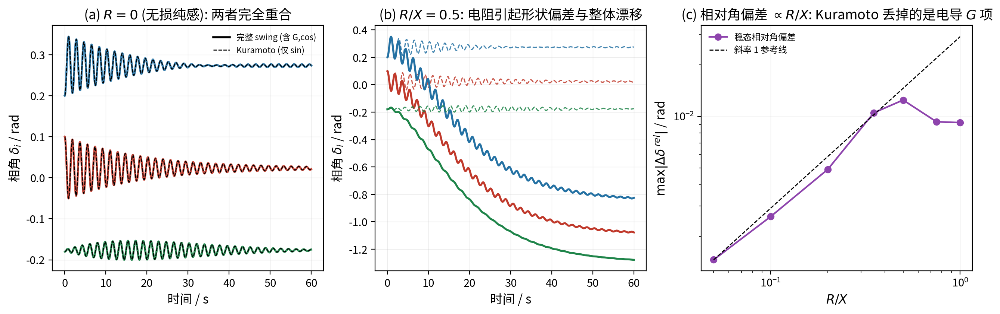
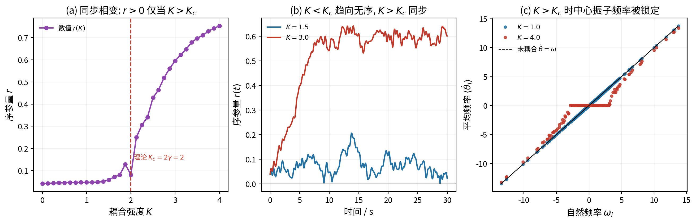
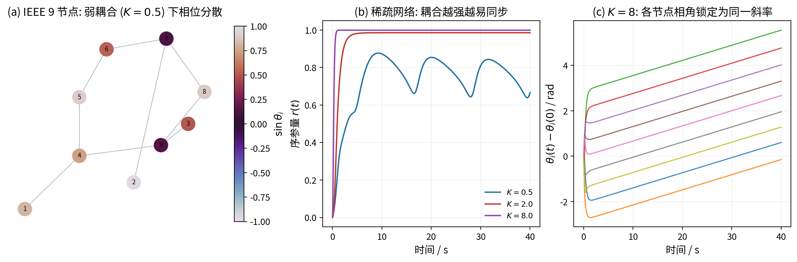

# Kuramoto 模型与电网同步：从 swing 方程到临界耦合

> **这篇文档要解决的问题**：为什么一个“振子同步”模型能描述电网的同步与失稳？
> 它的假设到底有多强？临界耦合 $K_c=2/(\pi g(0))$ 是怎么算出来的？
> 本文完整推导平均场、swing→Kuramoto 的退化、以及相变的自洽方程。
> 目标是**能把 $\theta_i,\omega_i,K$ 与电网物理量一一对上，并能自己验证相变**。
>
> **前置知识**：同步机摇摆方程、潮流功率方程、基本积分与分布函数。
> **本文用法**：§2–§3 建立模型并证明“swing 在三个假设下退化为 Kuramoto”，
> §4 完整推导相变与临界耦合，§6 给出与 RMS 的逐项关系；文末有自测题。本文独立自足。

---

## 1. 动机：什么是“同步”，为什么要研究它

交流电网的稳定运行依赖所有同步电源以**同一频率**旋转，且相对相角不越界。
当扰动使某些机组的相角超限，就会失步（out-of-step），严重时引发连锁脱网。

“同步”不是电网独有的现象：萤火虫闪光、心脏起搏细胞、钟摆耦合都有相同数学结构。
Kuramoto（1975）提出的相位振子模型抓住了这一共性，因此在电网、神经、社会系统中被反复使用。

**关键问题不是“能不能类比”，而是“电网在什么条件下等价于它”**——这是本文的核心。

---

## 2. Kuramoto 模型与变量含义

### 2.1 标准形式

$N$ 个弱耦合、近全同的相位振子：

$$
\dot\theta_i=\omega_i+\frac{K}{N}\sum_{j=1}^{N}\sin(\theta_j-\theta_i),
\qquad i=1,\dots,N .
\tag{2.1}
$$

| 符号 | 在 Kuramoto 中的含义 | 在电网中的对应 |
|---|---|---|
| $\theta_i$ | 振子相位 | 节点电压相角 / 机组转子角 $\delta_i$ |
| $\omega_i$ | 自然频率 | 节点净有功不平衡（$P_{m,i}/M_i$ 或 $P_{m,i}/D_i$） |
| $K$ | 耦合强度 | 线路电纳 $B_{ij}=1/X_{ij}$ 乘以电压幅值 $V_iV_j$ |
| $N$ | 振子数 | 节点数（或聚合后的机组数） |

### 2.2 序参量

$$
r e^{\jmath\psi}=\frac{1}{N}\sum_{j=1}^N e^{\jmath\theta_j},\qquad r\in[0,1] .
\tag{2.2}
$$

$r$ 是“同步程度”：$r=0$ 完全无序，$r=1$ 完全同步；$\psi$ 是平均相位。
物理上 $r$ 可理解为同步机组的“等效相干功率占比”。

### 2.3 平均场化（完整推导）

把式 (2.1) 的耦合项展开：

$$
\frac{K}{N}\sum_j\sin(\theta_j-\theta_i)
=\frac{K}{N}\sum_j\bigl[\sin\theta_j\cos\theta_i-\cos\theta_j\sin\theta_i\bigr]
=K\Bigl[\bar S\cos\theta_i-\bar C\sin\theta_i\Bigr],
\tag{2.3}
$$

其中 $\bar S=\frac1N\sum_j\sin\theta_j$、$\bar C=\frac1N\sum_j\cos\theta_j$。
而由式 (2.2)

$$
\bar C=r\cos\psi,\qquad \bar S=r\sin\psi .
\tag{2.4}
$$

代入式 (2.3)：

$$
K\bigl[r\sin\psi\cos\theta_i-r\cos\psi\sin\theta_i\bigr]
=Kr\sin(\psi-\theta_i).
\tag{2.5}
$$

于是式 (2.1) 等价于**平均场形式**

$$
\boxed{\;\dot\theta_i=\omega_i+K\,r(t)\sin\bigl(\psi(t)-\theta_i\bigr)\;}
\tag{2.6}
$$

**这一步的价值**：原本每步需要 $O(N^2)$ 的两两求和的耦合，变成了 $O(N)$ 的
“与平均场的相互作用”。这正是本项目 fig11 能用 $N=400$ 快速扫描 $K$ 的原因，
也是 Kuramoto 能被解析处理的关键。

---

## 3. 从同步机 swing 方程到 Kuramoto（完整推导）

### 3.1 swing 方程

同步机二阶经典模型：

$$
\dot\delta_i=\omega_i-\omega_s,\qquad
M_i\dot\omega_i=P_{m,i}-P_{e,i}-D_i(\omega_i-\omega_s).
\tag{3.1}
$$

### 3.2 电磁功率的网络表达

由节点功率方程（标幺形式，推导见电力系统教材）：

$$
P_{e,i}=V_i^2G_{ii}+\sum_{j\neq i}V_iV_j\bigl(G_{ij}\cos\delta_{ij}+B_{ij}\sin\delta_{ij}\bigr),
\qquad\delta_{ij}=\delta_i-\delta_j .
\tag{3.2}
$$

### 3.3 三个假设

- **(A1) 无损**：$G_{ij}=0$（线路只含电抗，忽略电阻）；
- **(A2) 恒幅值**：$V_i\equiv V$；
- **(A3) 均匀惯性/过阻尼**：$M_i\equiv M$、$D_i\equiv D$，或取过阻尼极限 $M_i\to0$。

在 (A1)(A2) 下式 (3.2) 变为

$$
P_{e,i}=\sum_{j\neq i}K_{ij}\sin\delta_{ij},\qquad
K_{ij}=V_iV_jB_{ij}=\frac{V_iV_j}{X_{ij}} .
\tag{3.3}
$$

### 3.4 得到 Kuramoto

把式 (3.3) 代入式 (3.1)：

$$
\boxed{\;M\ddot\delta_i=P_{m,i}-\sum_{j\neq i}K_{ij}\sin(\delta_i-\delta_j)-D\dot\delta_i\;}
\tag{3.4}
$$

若取过阻尼极限 $M\to0$（或做时间尺度归一化），式 (3.4) 化为

$$
\dot\delta_i=\frac{P_{m,i}}{D}-\sum_{j\neq i}\frac{K_{ij}}{D}\sin(\delta_i-\delta_j),
\tag{3.5}
$$

即标准 Kuramoto 式 (2.1)（把 $K_{ij}/D$ 视为耦合、$P_{m,i}/D$ 视为自然频率）。

**结论**：Kuramoto 不是类比，而是 swing 方程在 (A1)(A2)(A3) 下的**严格退化**。

### 3.5 假设的强度可以量化

放开 (A1)（即 $R\neq0$）后，$P_{e,i}$ 多出 $G_{ij}\cos\delta_{ij}$ 项。
本项目 fig10 用三机环网数值验证：

- $R=0$：完整 swing 与 Kuramoto **完全重合**；
- $R/X=0.5$：出现形状偏差与整体漂移；
- 稳态相对角偏差 $\propto R/X$（小 $R$ 时斜率 1）。

输电线路 $R/X\sim0.05$–$0.2$，偏差在百分之几；
配电网 $R/X\sim1$–$5$，(A1) 失效。

### 3.6 一个容易忽略的细节：整体漂移

式 (3.4) 只依赖角度差 $\delta_i-\delta_j$，因此对**整体旋转**
$\delta_i\to\delta_i+c$ 不变——所有 $\delta_i+c$ 都是平衡点（中性模式）。
这使得 $R\neq0$ 时系统可能沿整体方向漂移。
评价“形状误差”时必须先减去整体均值，否则会把中性漂移误记为模型误差。
本项目脚本 `fig10_swing_kuramoto.py` 的 `rel_dev()` 正是这样处理的。

---

## 4. 同步相变与临界耦合（完整推导）

### 4.1 物理图像

耦合弱时，各振子按自己的 $\omega_i$ 转，$r\to0$；
耦合超过阈值后，一部分振子被“锁”到共同频率，$r>0$ 并随 $K$ 增大。
这是**连续相变**（二阶相变），阈值记为 $K_c$。

### 4.2 锁定振子

在随 $\psi$ 旋转的坐标系中（令 $\psi=0$），式 (2.6) 的定常解要求

$$
\dot\theta_i=0\ \Longrightarrow\ \sin\theta_i=\frac{\omega_i}{Kr}.
\tag{4.1}
$$

当且仅当 $|\omega_i|\le Kr$ 时存在解：

$$
\theta_i=\arcsin\frac{\omega_i}{Kr}\qquad(\text{锁定振子}).
\tag{4.2}
$$

$|\omega_i|>Kr$ 的振子无法锁定，以“漂移”方式运动，对 $r$ 的贡献在一个周期内平均为零。

### 4.3 自洽方程

由序参量定义式 (2.2)，在 $N\to\infty$ 时用分布 $g(\omega)$ 与条件密度 $\rho(\theta|\omega)$ 表示：

$$
r=\int_{-\infty}^{\infty}\!\!\int_{-\pi}^{\pi}
e^{\jmath\theta}\rho(\theta|\omega)g(\omega)\,\mathrm d\theta\,\mathrm d\omega
\Big|_{\text{实部}} .
\tag{4.3}
$$

对锁定振子，$\rho(\theta|\omega)$ 是位于式 (4.2) 的 $\delta$ 函数；
漂移振子对实部平均为零。于是

$$
r=\int_{-Kr}^{Kr}\cos\Bigl(\arcsin\frac{\omega}{Kr}\Bigr)g(\omega)\,\mathrm d\omega .
\tag{4.4}
$$

利用 $\cos(\arcsin x)=\sqrt{1-x^2}$：

$$
\boxed{\;r=\int_{-Kr}^{Kr}\sqrt{1-\Bigl(\frac{\omega}{Kr}\Bigr)^2}\,g(\omega)\,\mathrm d\omega\;}
\tag{4.5}
$$

式 (4.5) 是 $r$ 的**自洽方程**：右边含 $r$，需自洽求解。

### 4.4 临界耦合

在临界点 $r\to0^+$，做变量替换 $\omega=Kru$：

$$
r=Kr\int_{-1}^{1}\sqrt{1-u^2}\,g(Kru)\,\mathrm du .
\tag{4.6}
$$

当 $r\to0$ 时 $g(Kru)\to g(0)$，并用

$$
\int_{-1}^{1}\sqrt{1-u^2}\,\mathrm du=\frac{\pi}{2},
\tag{4.7}
$$

得

$$
r=Kr\,g(0)\frac{\pi}{2}
\qquad\Longrightarrow\qquad
\boxed{\;K_c=\frac{2}{\pi\,g(0)}\;}
\tag{4.8}
$$

（$r>0$ 时两边可约去 $r$）。对 Lorentzian 分布 $g(\omega)=\dfrac{\gamma}{\pi(\omega^2+\gamma^2)}$，
$g(0)=1/(\pi\gamma)$，故

$$
K_c=2\gamma .
\tag{4.9}
$$

本项目 fig11(a) 用 $N=400$、Lorentzian 分布数值验证 $K_c=2\gamma$。

### 4.5 电网含义

$K_c$ 越大，越需要强网架（大 $B_{ij}$）或越小不平衡（小 $\gamma$）才能同步。
“接入更多 DER”$\Rightarrow$ 不平衡增大（$\gamma$ 增大）$\Rightarrow$
若网架不变则同步裕度下降。这给承载力提供了一个**可解析的宏观指标**。

但对真实网络，$K_c$ 还取决于**拓扑**，不能直接用式 (4.8)（下节）。

---

## 5. 网络拓扑的作用

全连接假设对应 $K/N$ 的平均场。真实电网是稀疏图，邻接矩阵 $\bm A$：

$$
\dot\theta_i=\omega_i+K\sum_{j}A_{ij}\sin(\theta_j-\theta_i).
\tag{5.1}
$$

本项目 fig12 在 IEEE 9 节点系统上数值表明：

- 稀疏网络需要更大的 $K$ 才能同步（全连接的 $K_c$ 是下界）；
- 同步从网络中心（度数大、靠近电源）开始扩散；
- 强耦合时各节点相角锁定为同一斜率。

拓扑与同步条件的关系（图论/代数连通度）是复杂网络领域的重要结果，
本报告只做数值展示，不展开。

---

## 6. Kuramoto 与 RMS 的关系

四类模型构成一个简化关系（注意 PF 与 Kuramoto 并列，不是前后两级）：

$$
\text{EMT}\xrightarrow[\text{忽略网络电磁暂态}]{\text{平均开关}}
\text{RMS}\xrightarrow[\ \dot{\bm x}=0\ ]{\text{取平衡点}}
\text{PF}\xrightarrow[\text{恒幅值、无损纯感}]{\text{消去网络}}
\text{Kuramoto}.
\tag{6.1}
$$

| | RMS | Kuramoto |
|---|---|---|
| 状态 | $\delta,\omega,E_q'$、控制器状态 | 仅 $\delta_i$（一阶）或 $\delta_i,\omega_i$（二阶） |
| 电压幅值 | 变量 | 常数（A2） |
| 网络 | 代数约束，含 $G,B$ | 消去为 $\sin$ 耦合，仅 $B$（A1） |
| 无功/损耗 | 保留 | 丢弃 |
| 可解析性 | 一般需数值积分 | 有相变等解析结论 |
| 适用 | 通用 | $X/R\gg1$、强电压支撑、宏观同步 |

**结论**：Kuramoto 是 RMS 的降阶模型，不是等价模型；
在输电网同步问题中可用，在配电网（$R/X$ 大、电压主导）不可替代潮流/RMS。

---

## 7. 变流器下垂控制与 Kuramoto

构网型变流器的 $P$–$f$ 下垂控制

$$
\dot\theta_i=\omega_i+m_i\bigl(P_i^{\text{set}}-P_i\bigr)
\tag{7.1}
$$

与式 (3.5) 结构相同：功率偏差驱动频率/相角，网络功率是 $\sin$ 耦合。
因此下垂控制的多机同步问题可以映射为 Kuramoto 模型，
已有严格结果（Simpson-Porco 等，2013）。
这是 Kuramoto 在高比例 IBR 场景下重新受到关注的原因。

---

## 8. 常见误解

1. **“Kuramoto 只是类比，不能定量”**——在 (A1)(A2)(A3) 下它是严格退化，
   误差 $\propto R/X$ 可量化（§3.5）。
2. **“二阶 Kuramoto 和一阶是一回事”**——含惯性的二阶模型（式 3.4）会出现
   更复杂的失稳模式（例如振荡型失步），一阶模型描述不了。
3. **“$K_c$ 只取决于 $\gamma$”**——那只是全连接的情形；稀疏拓扑会显著提高阈值。
4. **“Kuramoto 能替代潮流”**——不能。它丢掉了电压幅值与无功，二者对配电网是关键。

---

## 9. 与项目的联系

- 本项目关于 Kuramoto 的全部结论由本文推导支撑（式 3.4、4.8、6.1）；
- 本项目 fig10--12 是本文推导的数值验证；
- 本项目可把序参量 $r$ 作为“承载力”的一项宏观同步性指标，
  但必须同时报告 (A1)--(A3) 的满足程度（用 $R/X$ 与电压支撑水平衡量）。

**延伸阅读**：Y. Kuramoto, *Chemical Oscillations, Waves, and Turbulence*, 1984；
S. H. Strogatz, *From Kuramoto to Crawford*, Physica D, 2000；
F. Dörfler, F. Bullo, SIAM J. Control Optim., 2012；
J. W. Simpson-Porco 等, Automatica, 2013。

---

## 自测题

1. swing 方程退化为 Kuramoto 需要哪三个假设？放开“无损”会看到什么现象？
2. 为什么只有 $|\omega_i|\le Kr$ 的振子能被锁定？其余振子对序参量贡献如何？
3. $K_c=2/(\pi g(0))$ 的推导中，$\int_{-1}^{1}\sqrt{1-u^2}\,\mathrm du=\pi/2$ 起了什么作用？

参考答案要点

1. (A1) 无损 $G=0$、(A2) 电压幅值恒定、(A3) 均匀惯性或过阻尼。
   放开 (A1) 后 $P_e$ 多出 $G\cos\delta$ 项，出现形状偏差与整体漂移，
   且相对角偏差 $\propto R/X$。
2. 定常解要求 $\sin\theta_i=\omega_i/(Kr)$，故 $|\omega_i|\le Kr$；
   其余振子漂移，其 $e^{\jmath\theta}$ 在一个周期内平均为零，对 $r$ 无净贡献。
3. 它把 $\int\sqrt{1-u^2}\,g(Kru)\,\mathrm du$ 在 $r\to0$ 时的积分化为常数 $\pi/2$，
   使自洽方程两边可约去 $r$，从而解出 $K_c$。

